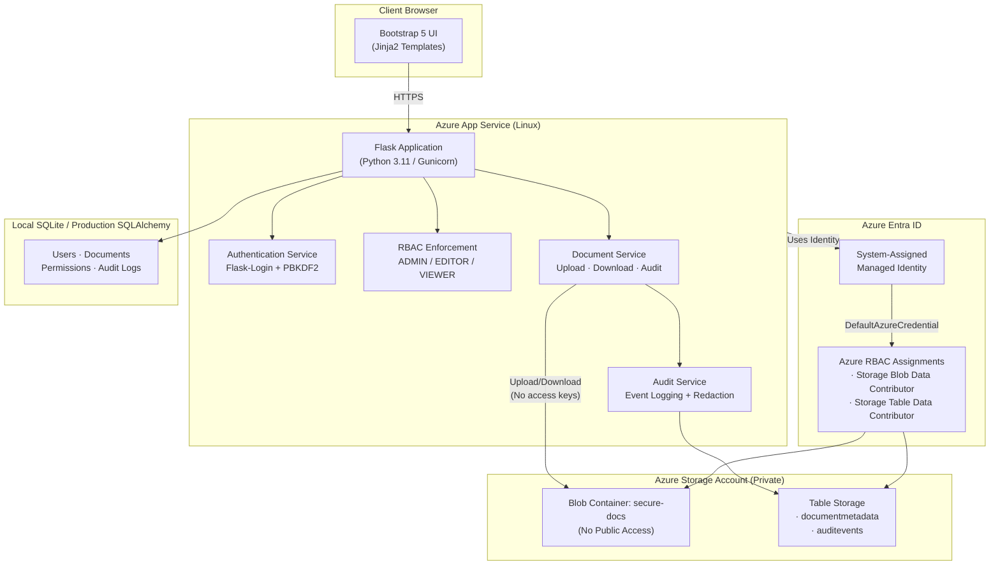
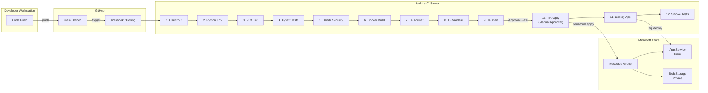
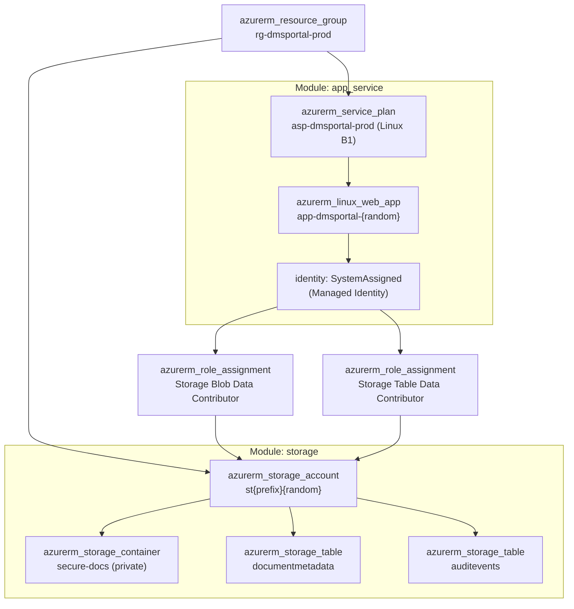

# System Architecture

## Application Architecture

```mermaid
graph TB
    subgraph Client["Client Browser"]
        UI["Bootstrap 5 UI\n(Jinja2 Templates)"]
    end

    subgraph AppServer["Azure App Service (Linux)"]
        Flask["Flask Application\n(Python 3.11 / Gunicorn)"]
        Auth["Authentication Service\nFlask-Login + PBKDF2"]
        RBAC["RBAC Enforcement\nADMIN / EDITOR / VIEWER"]
        DocSvc["Document Service\nUpload · Download · Audit"]
        AuditSvc["Audit Service\nEvent Logging + Redaction"]
    end

    subgraph Storage["Azure Storage Account (Private)"]
        Blob["Blob Container: secure-docs\n(No Public Access)"]
        Tables["Table Storage\n· documentmetadata\n· auditevents"]
    end

    subgraph Identity["Azure Entra ID"]
        MI["System-Assigned\nManaged Identity"]
        RBAC_Azure["Azure RBAC Assignments\n· Storage Blob Data Contributor\n· Storage Table Data Contributor"]
    end

    subgraph DB["Local SQLite / Production SQLAlchemy"]
        SQLite["Users · Documents\nPermissions · Audit Logs"]
    end

    UI -->|HTTPS| Flask
    Flask --> Auth
    Flask --> RBAC
    Flask --> DocSvc
    DocSvc --> AuditSvc
    DocSvc -->|"Upload/Download\n(No access keys)"| Blob
    AuditSvc --> Tables
    Flask --> SQLite
    MI -->|"DefaultAzureCredential"| RBAC_Azure
    RBAC_Azure --> Blob
    RBAC_Azure --> Tables
    AppServer -->|"Uses Identity"| MI
```

## CI/CD Pipeline Architecture

```mermaid
graph LR
    subgraph Dev["Developer Workstation"]
        Code["Code Push"]
    end

    subgraph GH["GitHub"]
        Repo["main Branch"]
        Webhook["Webhook / Polling"]
    end

    subgraph Jenkins["Jenkins CI Server"]
        P1["1. Checkout"]
        P2["2. Python Env"]
        P3["3. Ruff Lint"]
        P4["4. Pytest Tests"]
        P5["5. Bandit Security"]
        P6["6. Docker Build"]
        P7["7. TF Format"]
        P8["8. TF Validate"]
        P9["9. TF Plan"]
        P10["10. TF Apply\n(Manual Approval)"]
        P11["11. Deploy App"]
        P12["12. Smoke Tests"]
    end

    subgraph Azure["Microsoft Azure"]
        AppSvc["App Service\nLinux"]
        BlobSt["Blob Storage\nPrivate"]
        RG["Resource Group"]
    end

    Code -->|push| Repo
    Repo -->|trigger| Webhook
    Webhook --> P1
    P1 --> P2 --> P3 --> P4 --> P5 --> P6 --> P7 --> P8 --> P9
    P9 -->|"Approval Gate"| P10
    P10 --> P11 --> P12
    P11 -->|zip deploy| AppSvc
    P10 -->|terraform apply| RG
    RG --> AppSvc
    RG --> BlobSt
```

## Terraform Resource Map

```mermaid
graph TD
    RG["azurerm_resource_group\nrg-dmsportal-prod"]

    subgraph StorageModule["Module: storage"]
        SA["azurerm_storage_account\nst{prefix}{random}"]
        Container["azurerm_storage_container\nsecure-docs (private)"]
        MetaTable["azurerm_storage_table\ndocumentmetadata"]
        AuditTable["azurerm_storage_table\nauditevents"]
    end

    subgraph AppModule["Module: app_service"]
        ASP["azurerm_service_plan\nasp-dmsportal-prod (Linux B1)"]
        WebApp["azurerm_linux_web_app\napp-dmsportal-{random}"]
        MI["identity: SystemAssigned\n(Managed Identity)"]
    end

    RBAC1["azurerm_role_assignment\nStorage Blob Data Contributor"]
    RBAC2["azurerm_role_assignment\nStorage Table Data Contributor"]

    RG --> SA
    SA --> Container
    SA --> MetaTable
    SA --> AuditTable
    RG --> ASP
    ASP --> WebApp
    WebApp --> MI
    MI --> RBAC1
    MI --> RBAC2
    RBAC1 --> SA
    RBAC2 --> SA
```
